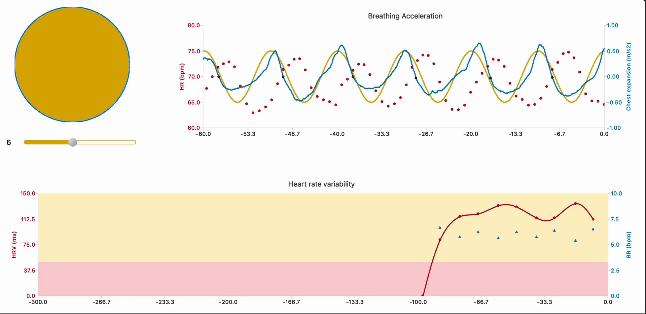

# Every Breath You Take – Heart Rate Variability Training with the Polar H10 Heart Rate Monitor

Through controlled breathing it is possible to regulate your body's stress reponse. This program allows you to measure and train this effect with a Polar H10 Heart Rate monitor.

Heart rate variability – the small changes in heart rate from beat-to-beat – is a reliable measure of stress response. Heart rate variability reflects the balance between the two sides of the autonomic nervous system: the fight-or-flight response (also called the sympathetic nervous response) and the rest-and-digest response (also called the parasympathetic nervous response).

Heart rate rises slightly during inhalation, and falls again during exhalation. In any given moment it is possible to restore balance to the autonomic nervous system by breathing slower and deeper. The on-screen pacer allows you to set a breathing rate to follow, breathing rate is measured from the chest strap accelerometer, and heart rate variability is calculated from the heart rate monitor.

## Features

- Connect to a Polar H10 heart rate monitor, simultanesouly record accelerometer and heart rate data (interbeat interval)
- Calculate and breathing rate and heart rate varability

## Installation
    
    python -m venv venv
    source venv/bin/activate  # On Windows, use `my_project_env\Scripts\activate`
    pip install -r requirements.txt
    python3 EBYT.py 

The program will automatically connect to the first Polar BLE device it is able to find
For best breathing detection, ensure the Polar H10 is fitted around the widest part of the ribcage

## Contributing
Feedback, bug reports, and pull requests are welcome. Feel free to submit an issue or create a pull request on GitHub.